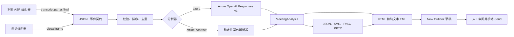

# 云上多模态会议 Agent

> 作者：魏新宇，微软云解决方案架构师

**中文** | [English](README.md)

[](https://www.python.org/)
[](LICENSE)
[](https://github.com/xinyuwei-david/Yunshang-Multimodal-Meeting-Agent/actions/workflows/ci.yml)
[](#人工控制的-outlook-交接)

一个与采集提供方解耦的 Python 流水线：把有序的转写事件和视觉上下文事件转换成结构化会议分析、思维导图、可编辑 PowerPoint，以及未发送的 New Outlook 草稿。

## 执行摘要

本仓库把采集提供方与会议智能解耦。本地 ASR 或视觉适配器输出严格的 JSONL 事件流；云上对事件进行校验、去重和排序，只分析 final 证据，生成可追溯产物，并可在 New Outlook 中打开 EML 草稿，交由用户审阅。

| 结果 | 已实现行为 | 验证 |
|---|---|---|
| 与提供方解耦的输入 | 四种事件类型和严格 Pydantic 校验 | `tests/test_models.py` |
| 会议分析 | Azure OpenAI 结构化输出或确定性的 offline contract 解析器 | `tests/test_azure_analyzer.py`、`tests/test_cross_input.py` |
| 产物 | JSON、SVG、PNG、可编辑 PPTX、HTML/纯文本 EML | `tests/test_artifacts.py`、已提交样例运行 |
| Outlook 交接 | 通过 `olk.exe` 打开带 `X-Unsent: 1` 的草稿 | `evidence/outlook-draft-probe.json` |
| 发送安全 | 不含 SMTP、Graph `sendMail`、Outlook `.Send` 或 UI Send 激活 | `scripts/audit_no_send.py` |

## 真实能力与适配器边界

| 能力 | 本仓库实际执行 | 证据 | 边界 |
|---|---|---|---|
| 事件接入 | 校验、排序、去重并计算 JSONL 事件 hash | 单元测试和两份样例事件流 | 采集传输由适配器提供 |
| 转写处理 | 生成产物时只使用 `transcript.final` | `tests/test_session.py` | 本仓库不执行 ASR 推理 |
| 视觉上下文 | 接受视觉摘要和可选 `image_uri` | 事件 schema 测试 | 屏幕捕获和图片理解属于视觉适配器 |
| Azure 分析 | 通过 Entra 调用 Azure OpenAI Responses v1，使用 Pydantic 结构化输出并设置 `store=False` | SDK 契约测试 | 公开仓库不提交真实 Azure response |
| 离线分析 | 为 CI 和集成测试生成确定性输出 | 两份内容显著不同的已提交运行 | 不是 AI 质量替代品，也不是生产 fallback |
| 产物生成 | 创建真实且可解析的 PNG/SVG/JSON/PPTX/EML | SHA-256 manifest 和产物测试 | 布局保持简洁，可按需定制 |
| New Outlook | 打开包含真实附件的可编辑 EML 草稿 | 脱敏 Windows 实测证据 | `--open-outlook` 需要 Windows 和 New Outlook |
| 邮件传输 | 不发送邮件 | 每个 CI job 执行静态审计 | 用户审阅后手动点击 Send |

已提交的样例证据使用 `offline-contract`。它证明事件到产物的契约、跨输入差异、文件完整性和草稿安全，不代表模型质量验证。脱敏 Outlook probe 仅验证 Windows 草稿交接。

## 架构



### 处理不变量

1. `event_id` 具有幂等性。相同 ID 对应不同内容时 fail closed。
2. 事件依次按 `sequence`、`timestamp`、`event_id` 排序。
3. ASR partial 假设永不进入摘要或附件。
4. 每个输入事件流和输出产物都有 SHA-256 摘要。
5. Azure 路径把事件内容视为不可信数据，而不是模型指令。
6. EML 必须包含 `X-Unsent: 1` 和至少一个真实附件。
7. 代码库不具备自动发送邮件的能力。

## 事件契约

每一行是一个 JSON 对象，未声明字段会被拒绝。

| 字段 | 类型 | 约束 | 用途 |
|---|---|---|---|
| `event_id` | string | 1 到 128 个字符 | 幂等键 |
| `session_id` | string | 1 到 128 个字符 | 会议边界 |
| `sequence` | integer | `>= 0` | 提供方顺序 |
| `timestamp` | RFC 3339 datetime | 必须带时区 | 确定性排序 |
| `kind` | enum | 见下表 | 事件行为 |
| `text` | string 或 null | 最长 20,000 字符 | 转写或视觉摘要 |
| `image_uri` | string 或 null | 最长 2,048 字符 | 适配器管理的图片引用 |
| `metadata` | object | 默认 `{}` | 提供方特有的非秘密元数据 |

| `kind` | 必要 payload | 流水线行为 |
|---|---|---|
| `transcript.partial` | 非空 `text` | 接收用于观测，但不进入产物 |
| `transcript.final` | 非空 `text` | 进入分析 |
| `visual.frame` | `text` 或 `image_uri` | 增加由适配器提供的视觉上下文 |
| `meeting.end` | 无 | 标记上游会议边界 |

示例：

```json
{"event_id":"event-004","session_id":"product-planning","sequence":4,"timestamp":"2026-01-15T09:00:08Z","kind":"transcript.final","text":"Mina will follow up with security and prepare the pilot checklist.","metadata":{"source":"local-asr"}}
```

完整事件流见 [examples/product-planning.jsonl](examples/product-planning.jsonl) 和 [examples/operations-review.jsonl](examples/operations-review.jsonl)。

## 证据展示

两次已提交运行的源内容、分析输出、思维导图、演示文稿和 EML hash 均不同。CI 会从磁盘重新计算每个摘要，并用来源事件流核对 evidence manifest。

| 运行 | 事件数 | 来源 SHA-256 | 分析 SHA-256 | 结果 |
|---|---:|---|---|---|
| `product-planning` | 6 | `413799e9783ac40a5a4e225a553bef94f33fd4c5990607add57e50547f91486b` | `988d06fa2c29be218c8945ddb23734ce07752e5e5428b5e80506194f30fd4864` | 独立的产品规划摘要 |
| `operations-review` | 6 | `88d71ad49cd875e2eb958c884e1ce2eb76a208576047df923decda79e7e109fb` | `22e4e3c9a679d3d3e3a7fbca64a16166ef4e4e546c5d2d35f2413cea9675dd13` | 独立的故障复盘摘要 |

### 产品规划样例


### 运维复盘样例


每次运行包含：

| 文件 | 用途 |
|---|---|
| `meeting-analysis.json` | 完整结构化分析 |
| `mind-map.json` | 与渲染器解耦的图结构 |
| `mind-map.svg` | 可缩放浏览器渲染 |
| `mind-map.png` | 适合邮件的位图 |
| `meeting-summary.pptx` | 可编辑的五页演示文稿 |
| `meeting-follow-up.eml` | 带 PNG 和 PPTX 附件的未发送 MIME 草稿 |
| `evidence.json` | 来源和产物大小/hash manifest |

## 快速开始

### 前置条件

- Python 3.11 或 3.12
- Linux、macOS 或 Windows 均可生成产物
- 仅使用 `--open-outlook` 时需要 New Outlook for Windows
- 仅使用 `--analyzer azure` 时需要 Azure OpenAI deployment

### 安装并运行 offline contract 路径

```bash
git clone https://github.com/xinyuwei-david/Yunshang-Multimodal-Meeting-Agent.git
cd Yunshang-Multimodal-Meeting-Agent
python3 -m venv .venv
source .venv/bin/activate
python -m pip install -r requirements-dev.txt
python -m pip install -e .
python -m yunshang.cli validate-events \
  --events examples/product-planning.jsonl
python -m yunshang.cli build \
  --events examples/product-planning.jsonl \
  --output-dir artifacts/product-planning \
  --analyzer offline-contract
```

安装后，`yunshang` 与 `python -m yunshang.cli` 等价。

### 在 Windows 上安装并运行

```powershell
py -3.12 -m venv .venv
.\.venv\Scripts\python.exe -m pip install -r requirements-dev.txt
.\.venv\Scripts\python.exe -m pip install -e .
.\.venv\Scripts\python.exe -m yunshang.cli build `
  --events examples\product-planning.jsonl `
  --output-dir artifacts\product-planning `
  --analyzer offline-contract
```

### 运行日志

事件校验输出：

```json
{"session_id":"product-planning","event_count":6,"content_sha256":"413799e9783ac40a5a4e225a553bef94f33fd4c5990607add57e50547f91486b"}
```

Evidence 摘要：

```json
{
  "analyzer": "offline-contract",
  "source": {
    "session_id": "product-planning",
    "event_count": 6,
    "content_sha256": "413799e9783ac40a5a4e225a553bef94f33fd4c5990607add57e50547f91486b"
  },
  "eml": {
    "x_unsent": "1",
    "recipient_count": 0,
    "attachment_count": 2
  },
  "automatic_send": false,
  "next_state": "DRAFT_READY_MANUAL_SEND_REQUIRED"
}
```

## Azure OpenAI 分析器

Azure 路径遵循当前 Responses v1 模式：

- `OpenAI(base_url="https://<resource>.openai.azure.com/openai/v1/")`
- Microsoft Entra token scope `https://ai.azure.com/.default`
- 使用 `DefaultAzureCredential` 支持环境变量、workload identity、managed identity 和开发者凭据
- 把 Pydantic `MeetingAnalysis` 传给 `responses.parse`
- Response 请求设置 `store=False`

本仓库锁定 `openai==2.32.0`，该版本提供 `responses.parse`。从 [.env.example](.env.example) 开始，把真实值设置到环境变量或本地被忽略的 `.env` 文件。

配置资源和 deployment，不提交凭据：

```bash
export AZURE_OPENAI_ENDPOINT="https://<resource>.openai.azure.com/"
export AZURE_OPENAI_DEPLOYMENT="<deployment-name>"
python -m yunshang.cli build \
  --events examples/product-planning.jsonl \
  --output-dir artifacts/azure-product-planning \
  --analyzer azure
```

`DefaultAzureCredential` 还必须找到有效身份。本地开发使用受支持的开发者凭据；部署服务优先使用同租户 managed identity，或具备最小权限的 workload/service identity。禁止把 token、client secret、租户专属 endpoint 或客户数据放入本仓库。

官方参考：

- [Azure OpenAI Responses API](https://learn.microsoft.com/azure/ai-foundry/openai/how-to/responses)
- [Azure Identity for Python](https://learn.microsoft.com/python/api/overview/azure/identity-readme)
- [Structured Outputs parsing helpers](https://github.com/openai/openai-python/blob/main/helpers.md)

## 人工控制的 Outlook 交接

在安装了 New Outlook 的 Windows 上，直接使用虚拟环境中的 Python executable：

```powershell
py -m venv .venv
.\.venv\Scripts\python.exe -m pip install -r requirements-dev.txt
.\.venv\Scripts\python.exe -m pip install -e .
.\.venv\Scripts\python.exe -m yunshang.cli build `
  --events examples\product-planning.jsonl `
  --output-dir artifacts\product-planning `
  --analyzer offline-contract `
  --open-outlook
```

命令先写入并校验 EML，再启动 `olk.exe <absolute-eml-path>`。Compose window 保持可编辑。本仓库不会点击 Send，也不会调用发送 API。

脱敏 Windows probe 记录：

| 检查 | 实测值 |
|---|---:|
| `X-Unsent` | `1` |
| 收件人数 | `0` |
| 附件数 | `2` |
| New Outlook window 变化 | `+1` |
| 自动发送 | `false` |

证据见 [evidence/outlook-draft-probe.json](evidence/outlook-draft-probe.json)。其中的产物 hash 用来标识私有 probe 文件；文件本体和用户专属窗口数据有意不公开。

## CLI 参考

```text
yunshang validate-events --events <meeting.jsonl>

yunshang build \
  --events <meeting.jsonl> \
  --output-dir <directory> \
  --analyzer {azure,offline-contract} \
  [--recipient <address>] \
  [--open-outlook]
```

`--recipient` 可以预填草稿地址，但不会发送。已提交证据有意使用零收件人。
多次指定 `--recipient` 可以预填多个审阅人，每个值必须是一个有效地址。Build 会对输出目录持有独占 `.yunshang.lock`；并发 build 必须使用不同输出目录，或等待当前 build 完成。执行 `build` 前，输入 JSONL 必须已经完整且不可变。

## Evidence 格式

每次 build 都会写入 `evidence.json`：

| Key | 含义 |
|---|---|
| `schema_version` | Evidence 契约版本 |
| `analyzer` | `azure` 或 `offline-contract` |
| `source` | Session ID、事件数和 canonical source SHA-256 |
| `artifacts` | 每个输出的相对文件名、字节数与 SHA-256 |
| `eml` | `X-Unsent`、收件人数、附件数/名称、Subject 和 SHA-256 |
| `automatic_send` | 在本仓库中始终为 `false` |
| `next_state` | `DRAFT_READY_MANUAL_SEND_REQUIRED` |

使用 `scripts/validate_sample_runs.py` 验证已提交样例。对于新运行，对照 `artifacts` 检查每个文件，并在打开草稿前确认 EML 安全字段。

## 测试与质量门禁

```bash
python scripts/audit_no_send.py
python scripts/audit_public_content.py
python scripts/validate_evidence.py
python scripts/validate_sample_runs.py
python scripts/validate_readmes.py
python scripts/pre_delivery_check.py
ruff check src tests scripts
pytest
pip-audit -r requirements.txt --progress-spinner off
```

CI 在 Ubuntu 和 Windows 上运行 Python 3.11 与 3.12。

| 测试区域 | 覆盖范围 |
|---|---|
| Schema | 每个 `MeetingEvent` 字段、全部四种 kind、未知字段、非法 payload |
| Session | 排序、幂等重复、冲突 ID、只选择 final transcript |
| Azure 契约 | v1 base URL、Entra scope、结构化输出类型、`store=False`、prompt 边界 |
| 真实性 | 两份内容显著不同的输入必须生成不同分析与 source hash |
| 产物 | 非空 `1280x720` PNG、有效 SVG/JSON、可解析 PPTX package |
| 草稿 | `X-Unsent`、收件人、附件、MIME 解析、规范化 Subject |
| 安全 | 自动传输 API 与 Send activation 静态失败门禁 |
| 证据 | 来源 hash、文件大小、产物 hash、EML 状态、跨运行差异 |

## 安全与隐私

- 输入是会议内容。调用云端分析器前，必须遵守所在组织的数据分类和保留策略。
- Azure 请求设置 `store=False`；Azure service 和 deployment policy 仍然适用。
- 事件 metadata 不得包含 secret、access token 或不必要的个人数据。
- Git 忽略 `.env`、`password.txt`、token 文件、runtime 输出和本地产物。
- Endpoint 和 deployment 值从环境变量读取。
- 公开证据为合成或脱敏内容，不含客户 endpoint、tenant、subscription、邮件地址或私有路径。
- `SECURITY.md` 规定负责任的漏洞报告方式。

## Schema 版本管理

`schema_version` 当前用于标识 `evidence.json`，版本 `1` 随 package `0.1.0` 引入。增加可选 evidence 字段可以不提升版本；删除字段、改变字段含义或改变 enum 值时必须使用新的 schema version 并提供迁移说明。当前不提供自动迁移工具。严格的 `MeetingEvent` 输入模型会拒绝未知字段，因此适配器维护者应锁定兼容 package 版本，并显式升级。

## 扩展流水线

在 core package 外实现适配器，并输出文档中的 JSONL 契约。这样可以让采集库、设备协议和提供方 SDK 与分析和产物层解耦。

新增分析器时实现：

```python
class Analyzer(Protocol):
    def analyze(self, session: MeetingSession) -> MeetingAnalysis:
        ...
```

返回现有 `MeetingAnalysis` schema，即可保持所有下游生成器和安全检查不变。

Custom analyzer 当前通过编程方式接入，而不是加入内置 CLI choice：

```python
from pathlib import Path

from yunshang.artifacts import generate_artifacts
from yunshang.session import load_jsonl

session = load_jsonl(Path("meeting.jsonl"))
analysis = CustomAnalyzer().analyze(session)
generate_artifacts(analysis, Path("artifacts/custom"))
```

## 项目结构

```text
src/yunshang/       核心 schema、session、analyzer、artifact、EML handoff 和 CLI
examples/           两份与提供方解耦的 JSONL 会议事件流
tests/              Schema、contract、跨输入、产物、草稿和 CLI 测试
scripts/            No-send 和证据验证门禁
evidence/           脱敏 Outlook probe 与已提交样例运行的 manifest/产物
.github/workflows/  跨平台 CI
```

## 局限性

- 本仓库不采集麦克风音频或屏幕像素。
- `visual.frame` 是外部适配器提供的文本摘要或引用。
- Offline analyzer 是确定性测试基础设施，不是生产 fallback。
- 公开证据不包含真实 Azure model invocation。
- New Outlook 启动仅支持 Windows，并依赖 `olk.exe` 可用。
- 生成的摘要和 action item 在外部使用前必须由人工审阅。
- 代码只创建草稿；交付、mailbox policy、signature 和 Send 仍由 Outlook 与用户负责。

## 故障排查

| 现象 | 检查项 |
|---|---|
| `at least one transcript.final event is required` | Build 前至少输出一个 final transcript segment |
| `AZURE_OPENAI_ENDPOINT ... required` | 同时设置两个 Azure 环境变量 |
| Azure `401` 或 `403` | 检查 `DefaultAzureCredential`、tenant、RBAC 和 `https://ai.azure.com/.default` scope |
| Azure `404` | 检查 deployment name 与 Responses API availability |
| 找不到 `olk.exe` | 安装 New Outlook，并确认同一 Windows session 可启动 |
| 草稿缺少预期数据 | 检查 `evidence.json`；对已提交样例运行 `validate_sample_runs.py` |

## 贡献

见 [CONTRIBUTING.md](CONTRIBUTING.md)。任何增加自动发信能力或削弱证据校验的修改都会被 CI 拒绝。

## 许可证

采用 [MIT License](LICENSE)。