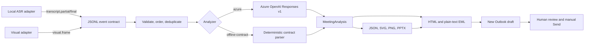
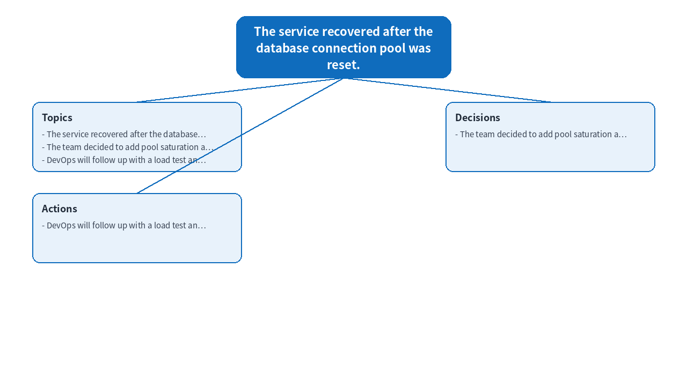

# Yunshang Multimodal Meeting Agent

> Author: Xinyu Wei, Cloud Solution Architect at Microsoft

[Chinese](README-CN.md) | **English**

[](https://www.python.org/)
[](LICENSE)
[](https://github.com/xinyuwei-david/Yunshang-Multimodal-Meeting-Agent/actions/workflows/ci.yml)
[](#human-controlled-outlook-handoff)

A provider-neutral Python pipeline that converts ordered transcript and visual-context events into a structured meeting analysis, mind map, editable PowerPoint, and an unsent New Outlook draft.

## Executive Summary

The repository separates capture providers from meeting intelligence. A local ASR or visual adapter emits a strict JSONL event stream; Yunshang validates and deduplicates it, analyzes only finalized evidence, generates traceable artifacts, and optionally opens an EML draft in New Outlook for human review.

| Outcome | Delivered behavior | Verification |
|---|---|---|
| Provider-neutral input | Four event kinds with strict Pydantic validation | `tests/test_models.py` |
| Meeting analysis | Azure OpenAI structured output or deterministic offline contract parser | `tests/test_azure_analyzer.py`, `tests/test_cross_input.py` |
| Artifacts | JSON, SVG, PNG, editable PPTX, HTML/plain EML | `tests/test_artifacts.py`, committed sample runs |
| Outlook handoff | `X-Unsent: 1` draft opened through `olk.exe` | `evidence/outlook-draft-probe.json` |
| Send safety | No SMTP, Graph `sendMail`, Outlook `.Send`, or UI Send activation | `scripts/audit_no_send.py` |

## What Is Real vs What Is Adapter-Owned

| Capability | What this repository does | Evidence | Boundary |
|---|---|---|---|
| Event intake | Validates, orders, deduplicates, and hashes JSONL events | Unit tests and two sample streams | Capture transport is supplied by an adapter |
| Transcript processing | Uses only `transcript.final` in generated artifacts | `tests/test_session.py` | ASR inference is not implemented here |
| Visual context | Accepts a visual summary and optional `image_uri` | Event schema tests | Screen capture and image interpretation belong to the visual adapter |
| Azure analysis | Calls Azure OpenAI Responses v1 with Entra auth, Pydantic structured output, and `store=False` | SDK contract test | No live Azure response is committed to this public repository |
| Offline analysis | Produces deterministic outputs for CI and integration testing | Two materially different committed runs | It is not an AI-quality substitute or production fallback |
| Artifact generation | Creates real, parseable PNG/SVG/JSON/PPTX/EML files | SHA-256 manifest and artifact tests | Layout is intentionally compact and customizable |
| New Outlook | Opens an editable EML draft with real attachments | Sanitized Windows probe | Windows and New Outlook are required for `--open-outlook` |
| Message transmission | Does not transmit mail | Static audit in every CI job | The user reviews and clicks Send manually |

The committed sample evidence uses `offline-contract`. It proves the event-to-artifact contract, cross-input behavior, file integrity, and draft safety. It does not claim model-quality validation. The sanitized Outlook probe validates the Windows draft handoff only.

## Architecture



### Processing invariants

1. `event_id` is idempotent. Reusing it with different content fails closed.
2. Events sort by `sequence`, then `timestamp`, then `event_id`.
3. Partial ASR hypotheses never enter summaries or attachments.
4. Every input stream and output artifact receives a SHA-256 digest.
5. Azure event content is treated as untrusted data, not as model instructions.
6. The EML must contain `X-Unsent: 1` and at least one real attachment.
7. The codebase contains no automatic mail-transmission capability.

## Event Contract

Each line is one JSON object. Unknown fields are rejected.

| Field | Type | Constraint | Purpose |
|---|---|---|---|
| `event_id` | string | 1 to 128 characters | Idempotency key |
| `session_id` | string | 1 to 128 characters | Meeting boundary |
| `sequence` | integer | `>= 0` | Provider ordering |
| `timestamp` | RFC 3339 datetime | Time zone required | Deterministic tie-breaking |
| `kind` | enum | See event kinds below | Event behavior |
| `text` | string or null | Up to 20,000 characters | Transcript or visual summary |
| `image_uri` | string or null | Up to 2,048 characters | Adapter-owned image reference |
| `metadata` | object | Default `{}` | Provider-specific non-secret metadata |

| `kind` | Required payload | Pipeline behavior |
|---|---|---|
| `transcript.partial` | Non-empty `text` | Accepted for observability, excluded from artifacts |
| `transcript.final` | Non-empty `text` | Included in analysis |
| `visual.frame` | `text` or `image_uri` | Adds adapter-supplied visual context |
| `meeting.end` | None | Marks the upstream meeting boundary |

Example:

```json
{"event_id":"event-004","session_id":"product-planning","sequence":4,"timestamp":"2026-01-15T09:00:08Z","kind":"transcript.final","text":"Mina will follow up with security and prepare the pilot checklist.","metadata":{"source":"local-asr"}}
```

See [examples/product-planning.jsonl](examples/product-planning.jsonl) and [examples/operations-review.jsonl](examples/operations-review.jsonl) for complete streams.

## Evidence Showcase

The two committed runs differ in source content, analysis output, mind map, presentation, and EML hashes. CI recalculates every digest from disk and checks each source stream against its evidence manifest.

| Run | Events | Source SHA-256 | Analysis SHA-256 | Result |
|---|---:|---|---|---|
| `product-planning` | 6 | `413799e9783ac40a5a4e225a553bef94f33fd4c5990607add57e50547f91486b` | `988d06fa2c29be218c8945ddb23734ce07752e5e5428b5e80506194f30fd4864` | Distinct planning summary |
| `operations-review` | 6 | `88d71ad49cd875e2eb958c884e1ce2eb76a208576047df923decda79e7e109fb` | `22e4e3c9a679d3d3e3a7fbca64a16166ef4e4e546c5d2d35f2413cea9675dd13` | Distinct incident summary |

### Product planning sample


### Operations review sample



Each run contains:

| File | Purpose |
|---|---|
| `meeting-analysis.json` | Full structured analysis |
| `mind-map.json` | Renderer-neutral graph |
| `mind-map.svg` | Scalable browser rendering |
| `mind-map.png` | Email-ready bitmap |
| `meeting-summary.pptx` | Editable five-slide presentation |
| `meeting-follow-up.eml` | Unsent MIME draft with PNG and PPTX attachments |
| `evidence.json` | Source and artifact size/hash manifest |

## Quick Start

### Prerequisites

- Python 3.11 or 3.12
- Linux, macOS, or Windows for generation
- New Outlook for Windows only when using `--open-outlook`
- An Azure OpenAI deployment only when using `--analyzer azure`

### Install and run the offline contract path

```bash
git clone https://github.com/xinyuwei-david/Yunshang-Multimodal-Meeting-Agent.git
cd Yunshang-Multimodal-Meeting-Agent
python3 -m venv .venv
source .venv/bin/activate
python -m pip install -r requirements-dev.txt
python -m pip install -e .
python -m yunshang.cli validate-events \
  --events examples/product-planning.jsonl
python -m yunshang.cli build \
  --events examples/product-planning.jsonl \
  --output-dir artifacts/product-planning \
  --analyzer offline-contract
```

After installation, `yunshang` and `python -m yunshang.cli` are equivalent.

### Install and run on Windows

```powershell
py -3.12 -m venv .venv
.\.venv\Scripts\python.exe -m pip install -r requirements-dev.txt
.\.venv\Scripts\python.exe -m pip install -e .
.\.venv\Scripts\python.exe -m yunshang.cli build `
  --events examples\product-planning.jsonl `
  --output-dir artifacts\product-planning `
  --analyzer offline-contract
```

### Example Output

Validation output:

```json
{"session_id":"product-planning","event_count":6,"content_sha256":"413799e9783ac40a5a4e225a553bef94f33fd4c5990607add57e50547f91486b"}
```

Evidence excerpt:

```json
{
  "analyzer": "offline-contract",
  "source": {
    "session_id": "product-planning",
    "event_count": 6,
    "content_sha256": "413799e9783ac40a5a4e225a553bef94f33fd4c5990607add57e50547f91486b"
  },
  "eml": {
    "x_unsent": "1",
    "recipient_count": 0,
    "attachment_count": 2
  },
  "automatic_send": false,
  "next_state": "DRAFT_READY_MANUAL_SEND_REQUIRED"
}
```

## Azure OpenAI Analyzer

The Azure path follows the current Responses v1 pattern:

- `OpenAI(base_url="https://<resource>.openai.azure.com/openai/v1/")`
- Microsoft Entra token scope `https://ai.azure.com/.default`
- `DefaultAzureCredential` for environment, workload identity, managed identity, and developer credentials
- Pydantic `MeetingAnalysis` passed to `responses.parse`
- `store=False` on the response request

The repository pins `openai==2.32.0`, which provides `responses.parse`. Start from [.env.example](.env.example), then set real values in your environment or a local ignored `.env` file.

Configure the resource and deployment without committing credentials:

```bash
export AZURE_OPENAI_ENDPOINT="https://<resource>.openai.azure.com/"
export AZURE_OPENAI_DEPLOYMENT="<deployment-name>"
python -m yunshang.cli build \
  --events examples/product-planning.jsonl \
  --output-dir artifacts/azure-product-planning \
  --analyzer azure
```

`DefaultAzureCredential` must also find a valid identity. For local development, use a supported developer credential. For deployed services, prefer managed identity in the same tenant or a workload/service identity with least-privilege access. Never place tokens, client secrets, tenant-specific endpoints, or customer data in this repository.

Official references:

- [Azure OpenAI Responses API](https://learn.microsoft.com/azure/ai-foundry/openai/how-to/responses)
- [Azure Identity for Python](https://learn.microsoft.com/python/api/overview/azure/identity-readme)
- [Structured Outputs parsing helpers](https://github.com/openai/openai-python/blob/main/helpers.md)

## Human-Controlled Outlook Handoff

On Windows with New Outlook installed, run the Python executable directly from the virtual environment:

```powershell
py -m venv .venv
.\.venv\Scripts\python.exe -m pip install -r requirements-dev.txt
.\.venv\Scripts\python.exe -m pip install -e .
.\.venv\Scripts\python.exe -m yunshang.cli build `
  --events examples\product-planning.jsonl `
  --output-dir artifacts\product-planning `
  --analyzer offline-contract `
  --open-outlook
```

The command writes the EML first, validates it, and launches `olk.exe <absolute-eml-path>`. The compose window remains editable. The repository never clicks Send and never calls a send API.

The sanitized Windows probe records:

| Check | Observed value |
|---|---:|
| `X-Unsent` | `1` |
| Recipient count | `0` |
| Attachment count | `2` |
| New Outlook window delta | `+1` |
| Automatic send | `false` |

See [evidence/outlook-draft-probe.json](evidence/outlook-draft-probe.json). Artifact hashes in that file identify the private probe files; the files and any user-specific window data are intentionally not published.

## CLI Reference

```text
yunshang validate-events --events <meeting.jsonl>

yunshang build \
  --events <meeting.jsonl> \
  --output-dir <directory> \
  --analyzer {azure,offline-contract} \
  [--recipient <address>] \
  [--open-outlook]
```

`--recipient` can pre-address the draft but does not send it. The committed evidence intentionally uses zero recipients.
Specify `--recipient` more than once to pre-address multiple reviewers. Each value must be one valid address. A build holds an exclusive `.yunshang.lock` for its output directory; concurrent builds must use different output directories or wait for the active build to finish. The input JSONL must be immutable and complete before `build` starts.

## Evidence Format

Each build writes `evidence.json` with:

| Key | Meaning |
|---|---|
| `schema_version` | Evidence contract version |
| `analyzer` | `azure` or `offline-contract` |
| `source` | Session ID, event count, and canonical source SHA-256 |
| `artifacts` | Relative filename, byte count, and SHA-256 for every output |
| `eml` | `X-Unsent`, recipient count, attachment count/names, subject, and SHA-256 |
| `automatic_send` | Always `false` in this repository |
| `next_state` | `DRAFT_READY_MANUAL_SEND_REQUIRED` |

Use `scripts/validate_sample_runs.py` to verify the committed examples. For a new run, compare each file with its entry in `artifacts` and confirm the EML safety fields before opening the draft.

## Testing and Quality Gates

```bash
python scripts/audit_no_send.py
python scripts/audit_public_content.py
python scripts/validate_evidence.py
python scripts/validate_sample_runs.py
python scripts/validate_readmes.py
python scripts/pre_delivery_check.py
ruff check src tests scripts
pytest
pip-audit -r requirements.txt --progress-spinner off
```

CI runs on Ubuntu and Windows with Python 3.11 and 3.12.

| Test area | Coverage |
|---|---|
| Schema | Every `MeetingEvent` field, all four kinds, unknown fields, invalid payloads |
| Session | Ordering, idempotent duplicates, conflicting IDs, final-only transcript selection |
| Azure contract | v1 base URL, Entra scope, structured output type, `store=False`, prompt boundary |
| Authenticity | Two materially different inputs must produce different analysis and source hashes |
| Artifacts | Nonblank `1280x720` PNG, valid SVG/JSON, parseable PPTX package |
| Draft | `X-Unsent`, recipients, attachments, MIME parsing, normalized subject |
| Safety | Static failure gate for automatic transmission APIs and Send activation |
| Evidence | Source hashes, file sizes, artifact hashes, EML state, cross-run distinction |

## Security and Privacy

- Input is meeting content. Apply organizational data classification and retention policy before calling any cloud analyzer.
- The Azure request sets `store=False`; Azure service and deployment policies still apply.
- Event metadata must not contain secrets, access tokens, or unnecessary personal data.
- `.env`, `password.txt`, token files, runtime output, and local artifacts are ignored by Git.
- Endpoint and deployment values come from environment variables.
- The public evidence is synthetic or sanitized and contains no customer endpoint, tenant, subscription, email address, or private path.
- `SECURITY.md` defines responsible vulnerability reporting.

## Schema Versioning

`schema_version` currently versions `evidence.json`, with version `1` introduced in package version `0.1.0`. Additive evidence fields may be introduced without incrementing it; removing a field, changing its meaning, or changing an enum value requires a new schema version and migration notes. No automatic migration tool is currently provided. The strict `MeetingEvent` input model rejects unknown fields, so adapter owners should pin a compatible package version and update deliberately.

## Extending the Pipeline

Implement adapters outside the core package and emit the documented JSONL contract. This keeps capture libraries, device protocols, and vendor SDKs out of the analysis and artifact layers.

To add an analyzer, implement:

```python
class Analyzer(Protocol):
    def analyze(self, session: MeetingSession) -> MeetingAnalysis:
        ...
```

Return the existing `MeetingAnalysis` schema so every downstream generator and safety check remains unchanged.

Custom analyzers are currently wired programmatically rather than through the built-in CLI choices:

```python
from pathlib import Path

from yunshang.artifacts import generate_artifacts
from yunshang.session import load_jsonl

session = load_jsonl(Path("meeting.jsonl"))
analysis = CustomAnalyzer().analyze(session)
generate_artifacts(analysis, Path("artifacts/custom"))
```

## Project Structure

```text
src/yunshang/       Core schemas, session logic, analyzers, artifacts, EML handoff, CLI
examples/           Two provider-neutral JSONL meeting streams
tests/              Schema, contract, cross-input, artifact, draft, and CLI tests
scripts/            No-send and evidence validation gates
evidence/           Sanitized Outlook probe and committed sample-run manifests/artifacts
.github/workflows/  Cross-platform CI
```

## Limitations

- This repository does not capture microphone audio or screen pixels.
- Visual frames are textual summaries or references supplied by an external adapter.
- The offline analyzer is deterministic test infrastructure, not a production fallback.
- The public evidence does not include a live Azure model invocation.
- New Outlook launch is Windows-only and depends on `olk.exe` being available.
- Generated summaries and action items require human review before external use.
- The code creates a draft only; delivery, mailbox policy, signatures, and Send remain with Outlook and the user.

## Troubleshooting

| Symptom | Check |
|---|---|
| `at least one transcript.final event is required` | Emit a final transcript segment before building |
| `AZURE_OPENAI_ENDPOINT ... required` | Set both Azure environment variables |
| Azure `401` or `403` | Verify `DefaultAzureCredential`, tenant, RBAC, and the `https://ai.azure.com/.default` scope |
| Azure `404` | Verify the deployment name and Responses API availability |
| `olk.exe` not found | Install New Outlook and verify it can be launched from the same Windows session |
| Draft opens without expected data | Inspect `evidence.json`, then run `validate_sample_runs.py` for committed samples |

## Contributing

See [CONTRIBUTING.md](CONTRIBUTING.md). Changes that add automatic message transmission or weaken evidence validation will fail CI.

## License

Licensed under the [MIT License](LICENSE).